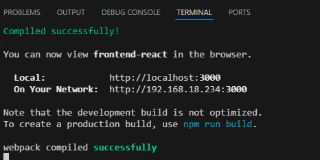

# test-pt360
Test Fullstack Developer

## Running Aplikasi

Aplikasi Terdiri dari 3 layer :
1. Backend : menggunakan Laravel
2. Middleware/proxy : menggunakan nodejs
3. Frontend : mengunakan reactjs

### A. Langkah - langkah menjalankan Backend :

#### Requirement :
- Install PHP/ XAMPP 8 : https://www.apachefriends.org/download.html
- Install Composer : https://getcomposer.org/download/

#### Direktori Project
untuk masuk ke Direktori project Backend buka folder backend-laravel atau jika dengan command ketikan `cd backend-laravel`


Untuk mempermudah siapkan database baik menggunakan SQLServer maupun MariaDB, dan ubah pengaturan pada file `.env` :


pada panduan ini menggunakan MariaDB dengan cukup menginstall XAMPP

#### Migration
Jalankan migration database :
```
php artisan migrate

```
#### Sedder
Jalankan seeder untuk membantu data dummy saat proses development
```
php artisan migrate:fresh --seed

```

#### Menguji Backend
Untuk menguji backend berfungsi jalankan perintah
```
php artisan serve
```

kemudian akses `http://127.0.0.1:8000/api/products`
jika tampil seperti berikut artinya sudah berjalan dengan baik :


### B. Langkah - langkah menjalankan Midleware :

#### Requirement :
- Install Nodejs : https://nodejs.org/en/download

#### Direktori Project
untuk masuk ke Direktori project Middleware buka folder middleware-express atau jika dengan command ketikan `cd middleware-express`

#### Install Dependency
Untuk memulai lakukan installasi dependecy dengan perintah :
```
npm install
```

#### Menguji Middleware
Untuk menguji Middleware berfungsi jalankan perintah
```
npm run start
```

jika muncul seperti berikut artinya server proxy sudah berjalan :


kemudian akses `http://localhost:3001/api/products`
jika tampil seperti berikut artinya sudah berjalan dengan baik :


### C. Langkah - langkah menjalankan Frontend :

#### Requirement :
- Install Nodejs : https://nodejs.org/en/download

#### Direktori Project
untuk masuk ke Direktori project Frontend buka folder frontend-react atau jika dengan command ketikan `cd frontend-react`

#### Install Dependency
Untuk memulai lakukan installasi dependecy dengan perintah :
```
npm install
```

#### Menguji Middleware
Untuk menguji Middleware berfungsi jalankan perintah
```
npm run start
```

jika muncul seperti berikut artinya server proxy sudah berjalan :


kemudian akses `http://localhost:3001/api/products`
jika tampil seperti berikut artinya sudah berjalan dengan baik :
